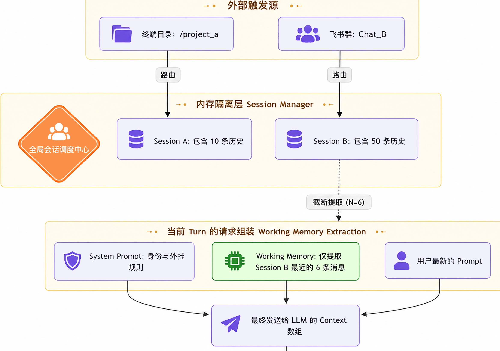
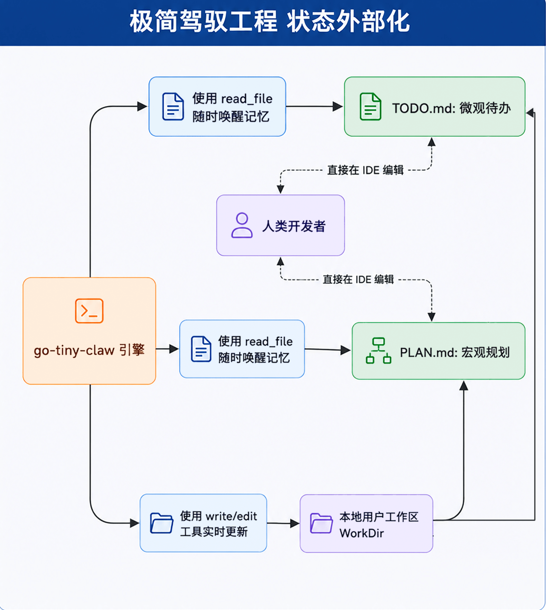
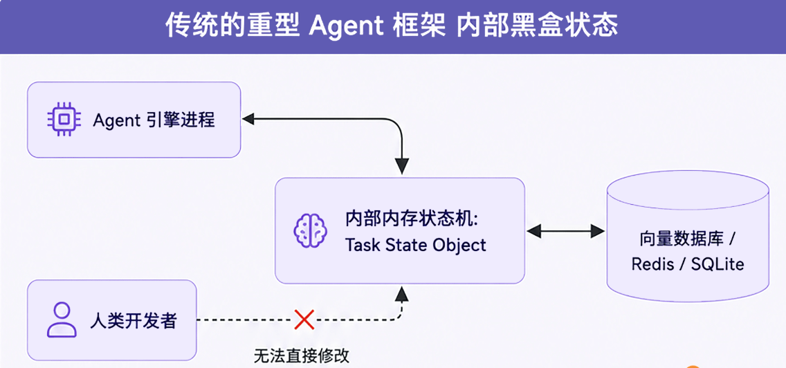
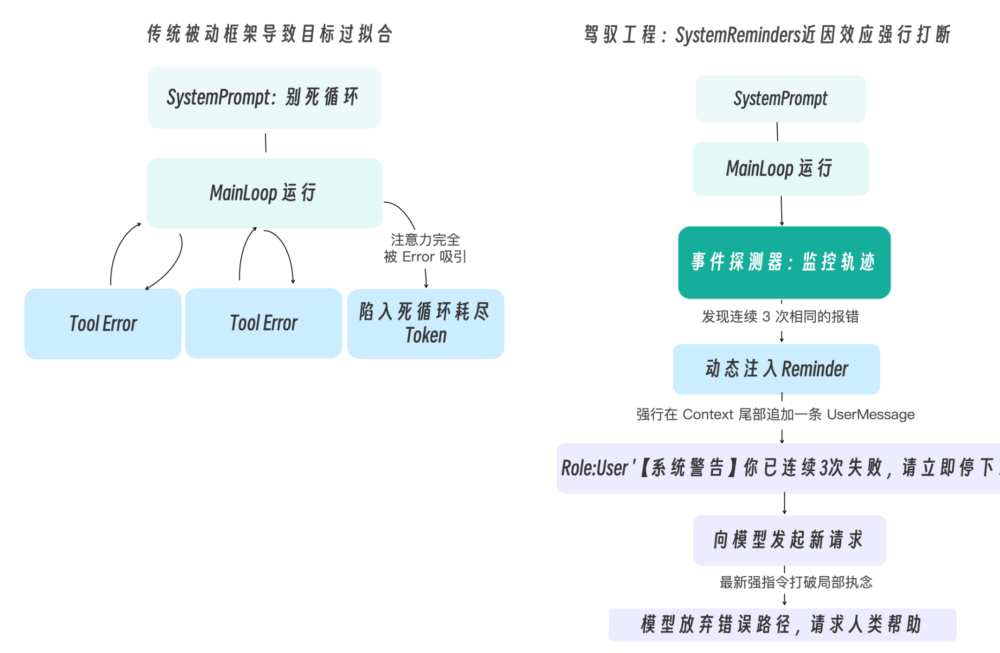

# 1、自适应推理（Adaptive Reasoning）


# 2、一个标准的 Skill目录如下
```
my-skill/
├── SKILL.md          # 必填：包含 YAML 元数据与 Markdown 格式的执行指令
├── scripts/          # 选填：技能专属的可执行脚本
├── references/       # 选填：参考文档
└── assets/           # 选填：模板或静态资源
```
> 其中 skill.md 必须以 YAML Frontmatter 开头，定义技能的 name（名称）和 description（何时使用该技能），
> 随后才是具体的 Markdown 指令正文

# 多端并发场景下的 Session（会话）物理隔离。

# Working Memory（短期工作记忆）
- Token 感知截断（Token-aware Truncation）：系统不会简单按“条数”截取，而是实时计算每条历史消息的 Token 数量（通过 BPE 词表）。
它会从后往前塞入消息，直到总 Token 逼近模型安全水位线（比如 120k Tokens）时才停止
- 摘要接力（Episodic Summarization）：这是一种极其高级的玩法。当历史记录被截断时，引擎会在后台触发一个小的廉价模型，将“被抛弃的远古历史”浓缩成一段百字左右的大纲（Summary），
并将其塞入 System Prompt 的头部。这样，大模型既拥有了最新的细节记忆，又保留了远古的宏观记忆


# Context Compaction 上下文压缩策略
- System Prompt（系统提示）：永远保留，神圣不可侵犯。
- 远期历史：超出 Working Memory 保护区的早期对话。在这里，大模型的 ToolCall（调用了什么工具、传了什么参数）必须保留以维持逻辑链，
但是工具执行的返回结果（往往几千字）将被彻底掩码替换（Masking），比如变成一句话：“…[为了节省内存，早期的工具输出已被系统清理。原始长度: 15000 字节]…”
- Working Memory（短期工作记忆）: 最近的N轮对话。我们期望它是完整的。但如果其中单条工具输出实在太长（比如超过了 1000 字符），哪怕它处于保护区内，我们也必须触发掐头去尾截断法（Head-Tail Truncation），仅保留前 500 字和后 500 字。
因为对于报错日志来说，开头说明了错因，结尾通常带有堆栈总结，中间的无尽循环完全可以抛弃。

# Context Compaction 工业做法
- 大模型摘要压缩（LLM-based Summarization）：这是最经典的做法。当历史记录逼近水位线时，
后台会异步调用一次成本较低的模型（可以是同系列的轻量版，或主力模型的低价 API 调用），将过去的几十条记录浓缩为一份几百字的“剧情提要”，并用它替换掉原来的长历史。
这能最大限度地保留关键语义，但缺点是增加了 API 成本和延迟，且摘要模型本身可能产生“幻觉遗漏”。
- 自适应检索增强（Agent Memory / Memory Paging）：借鉴操作系统的虚拟内存分页机制。Agent 会将长历史日志分块灌入本地的向量数据库（Vector DB），
上下文里只保留摘要。当大模型在后续推理中需要查看细节时，主动调用类似 search_memory 的工具将相关片段“换入”上下文。
- 大语言模型原生进化（Long Context Models）：随着模型底座能力的飙升，支持的上下文窗口进一步增大，“大力出奇迹”正在成为可能。
未来，我们或许不再需要写复杂的 Compactor，而是直接将几个 G 的日志全量扔给模型。但就目前的 API 计费模式而言，这依然是土豪的专属玩法

# Context 外部化
- PLAN.md：用于存放宏大的架构设计、重构思路和全局约束。
- TODO.md：用于存放细颗粒度的待办事项列表（Checklist）和当前进度状态。



# 什么情况下开启慢思考，通过动态算力分配
- 宏观触发：当外部记忆文件（PLAN.md）检测到任务目标发生变更时，在下一个 Turn 开始前开启慢思考，重新校准执行策略。
- 微观触发：当某个工具调用返回了非预期的结果（Error 或与预期严重偏差的输出）时，在当前 Turn 内动态开启慢思考，对局部异常进行推理后再决定下一步动作。

# Agent Memory 的多层沉淀与检索
- 短期工作记忆（Working Memory）：它只保留最近 N 轮的会话消息，保证当前 API 请求不会 OOM。这是模型思考的“草稿纸”。
- 任务级状态记忆（State Memory）：它伴随当前具体任务的生灭，任务结束后即被归档。这是模型的任务看板。
- 情景记忆沉淀池（Episodic Memory）： 在 OpenClaw 的底层实现中，引擎会在工作区（默认 ~/.openclaw/workspace）的 memory/ 目录下，按日期自动生成如 2026-04-12.md 的 Markdown 日志文件，
同时维护一份汇总长期事实、偏好和关键决策的 MEMORY.md。每当上下文即将被 Compaction（压缩）之前，OpenClaw 会自动触发一个静默轮次，将当前会话中尚未落盘的重要信息写入记忆文件，防止上下文丢失。此外，
还有可选的 Dreaming（实验性）后台机制，它会对短期记忆信号进行评分，并将高质量条目晋升至长期记忆 MEMORY.md。
- 长程记忆检索（Hybrid Retrieval）： 当用户提出跨越周期的历史性问题时，Agent 会自动调用 memory_search 工具，从上述的情景记忆沉淀池中大海捞针，精准提取过去的经验，再拼接回当前的 Working Memory 中。
其底层采用混合检索（Hybrid Search）策略——同时运行向量搜索（语义相似性，用于理解近义表达）和 BM25 关键词搜索（用于精确匹配 ID、错误字符串、配置键名等），并将两路结果合并排序。Embedding 向量由 OpenAI、Gemini、Voyage、Mistral 等提供商生成，开箱即用；也可使用本地模型实现完全离线的语义检索。

# 上下文感知的错误自愈（Error Recovery）


# 为什么会出现死循环？
- 上下文内容分布偏移：当模型连续几次遇到同一个棘手的 Error 时，上下文末尾会堆积大量结构相似的错误信息（ToolResult）。
这些高度重复的 token 在内容分布上占据了绝对主导，使得模型的下一步生成被这些近期输入强力牵引，表现出“只想解决眼前报错”的行为倾向。这并非注意力机制本身发生了结构性故障，而是输入内容的分布决定了输出的走向。
- 近因偏差（Recency Bias）：这一现象在学术上有实证支撑——研究表明，当关键信息位于长上下文的头部或中部时，模型对其的响应权重会显著低于位于上下文末尾的信息（即 Lost in the Middle 效应）。
相比于写在上下文最顶端、长达数千字的、泛泛而谈的系统规则，模型更倾向于对距离它最近的输入（即刚刚返回的那个 ToolResult 报错信息）做出强烈反应。


# 实现防死循环的 System Reminders（运行时提醒干预）机制
> 检测到死循环后，需要比如在Prompt末尾加入一条强制命令

# 物理防线，方式ai高危操作的控制
- 沙箱（Sandboxing）：物理隔离手段，Agent 运行在隔离的 Docker 容器、轻量级沙箱或 MicroVM 中
- 权限控制：单纯靠沙箱是不够的，因为操作的后果是真实且不可逆的。此时，必须引入细粒度的权限体系（Permission System）。 
我们可以通过 Middleware 模拟类似 allow / ask / deny 的三态控制：
  - allow：白名单命令（如 git status），直接放行。
  - ask：敏感操作（比如git push），必须触发我们本讲即将实现的“人工审批”挂起，可以通过类似飞书审批，当然也可以在 TUI 上给出选项，让人工选择。
  - deny：黑名单操作，直接拦截并报错。

# 如何解决单体上下文的天花板
- 任务委派（Delegation）与多智能体（Multi-Agent / Subagent）架构

# 多智能体架构演进
- 黑板架构（Blackboard Architecture）与共享任务列表：系统会分配一个全局共享任务列表（Shared Task Board）。
主 Agent（如架构师）把大拆解后的子任务写入任务列表，多个具备不同专长（如前端、后端、DBA）的子智能体像“消息订阅者”一样，各自认领任务并并行工作。它们的工作进度会实时更新在任务列表上，主 Agent 可以随时查阅并下发新的指令。Claude Code Agent Teams 已在工程层面实现了这一模式的原生支持。
- 点对点协商（P2P Negotiation）与依赖挂起：
- 群体辩论与一致性投票：在某些极度敏感的场景（如线上核心代码 Review），Harness 引擎会同时拉起 3 个不同大模型（比如 Claude Sonnet、GPT-5.x、Gemini 系列）驱动的 Reviewer Subagent。
这三个子智能体会先分别输出 Review 意见，然后互相审查对方的意见，直到达成多数票共识，才会将最终报告反馈给人类。这极大地消除了单一模型的幻觉。

# 如果评估ai agent演进是否正确？
- 结果评估（Outcome-Based）vs 轨迹评估（Trajectory-Based）
  - 结果评估：只看最终答案对不对，类似于“考试只看最终分数”。SWE-bench 的 pass/fail 就是典型的结果评估，简单客观，易于自动化。
  - 轨迹评估：则关注 Agent 走过的每一步是否合理。它会比对 Agent 实际执行的工具调用序列与标准答案中期望的序列是否一致。
- LLM-as-Judge 与 Agent-as-Judge
  - Agent-as-Judge 框架则将这一思路延伸到了自主 Agent 领域。它提出用一个“裁判 Agent”来评估另一个“选手 Agent”，从而实现对完整轨迹的评估，而不仅仅是最终结果。在实践中，“多 Agent 裁判”范式会让多个具备不同视角的 LLM Agent 同时担任评委，模拟多维度的人类判断，以提升评估结论的可靠性。
- 子目标完成率：
- 持续评估与防过拟合：
- 与 CI/CD 流水线集成：


