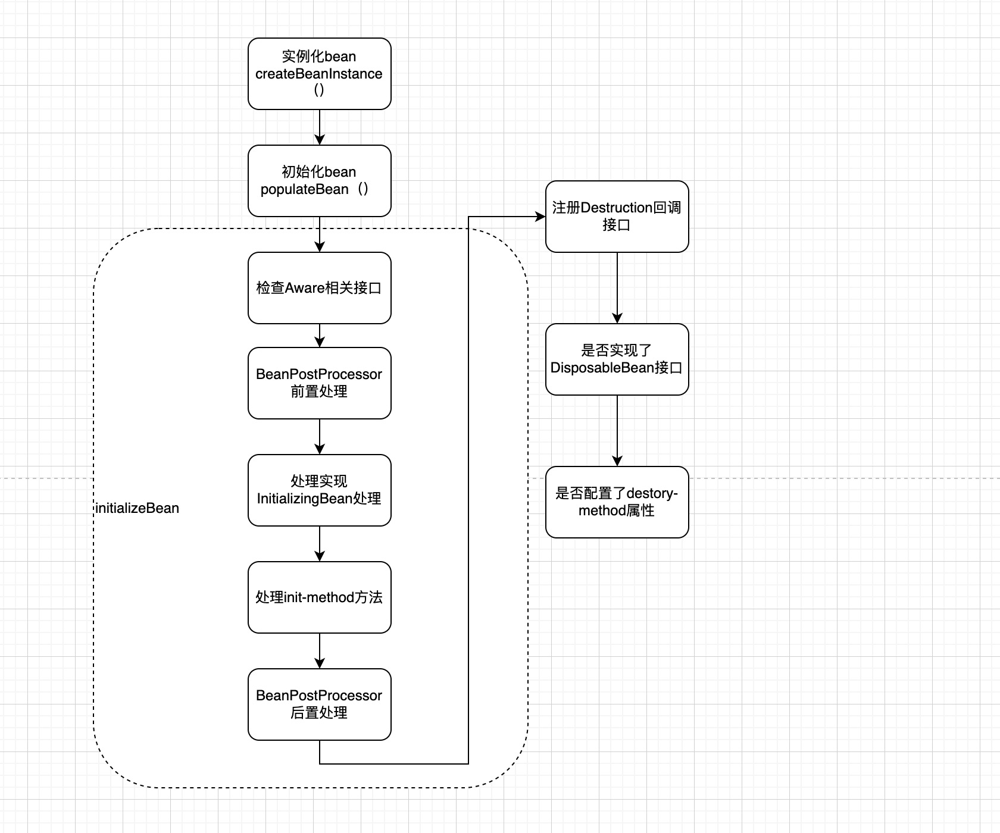

# 1、Spring的事务传播特性有哪些？
> 什么是事务的传播特性：很多同学把事务传播特性和事务隔离级别搞混淆。
> 
> 传播特性指的是，多个方法存在调用关系时，各个方法执行的事务是一种什么关系。
> 
> 事务隔离级别：主要是针对单个事务执行后，对其他事务的可见行的一种划分。
```java
// 通过枚举查看到有7个枚举值
public enum Propagation {
    REQUIRED, SUPPORTS, MANDATORY, REQUIRES_NEW, NOT_SUPPORTED, NEVER, NESTED;
}
```
- REQUIRED(Spring默认的传播级别)：如果当前没有事务，就创建一个新的事务，如果当前有事务，则加入当前事务。
- REQUIRES_NEW：如果当前没有事务，就创建一个新的事务，如果当前有事务，则挂起当前事务，创建一个新的事务。
- NESTED：如果当前没有事务，就创建一个新的事务，如果当前有事务，则这是一个保存点，并创建一个新的嵌套事务。
- SUPPORTS：如果当前存在事务，则加入当前事务，如果当前没有事务，则已非事务方式运行。
- MANDATORY：如果当前存在事务，则加入当前事务，如果当前没有事务，则抛出异常
- NOT_SUPPORTED：以非事务方式运行，如果当前存在事务，则挂起当前事务
- NEVER：不是事务运行，如果当前有事务，则抛出异常
> 其中REQUIRES_NEW和NESTED的区别是啥？
> 
> 在存在当前事务的情况下，REQUIRES_NEW创建的新事务，与父事务无关，自己方法执行完后，就提交了事务。
> 
> NESTED创建的是一个嵌套事务，在当前方式执行完成后不会马上提交事务，而是和父事务一起提交事务。
 
# 2、Spring中过滤器和拦截器有什么区别？
```java

// Filter 是servlet的体系下面的
package javax.servlet;

public interface Filter {
    // 在容器初始化时调用init方法，只会调用一次
    default void init(javax.servlet.FilterConfig filterConfig) throws javax.servlet.ServletException { /* compiled code */ }

    // 具体的逻辑处理
    void doFilter(javax.servlet.ServletRequest servletRequest, javax.servlet.ServletResponse servletResponse, javax.servlet.FilterChain filterChain) throws java.io.IOException, javax.servlet.ServletException;

    // 容器销毁时，被调用
    default void destroy() { /* compiled code */ }
}

// spring容器中的一员
package org.springframework.web.servlet;

public interface HandlerInterceptor {
    // 请求方法前置拦截，该方法会在Controller处理之前进行调用
    default boolean preHandle(javax.servlet.http.HttpServletRequest request, javax.servlet.http.HttpServletResponse response, java.lang.Object handler) throws java.lang.Exception { /* compiled code */ }
    // preHandle返回结果为true时，在Controller方法执行之后，视图渲染之前被调用
    default void postHandle(javax.servlet.http.HttpServletRequest request, javax.servlet.http.HttpServletResponse response, java.lang.Object handler, @org.springframework.lang.Nullable org.springframework.web.servlet.ModelAndView modelAndView) throws java.lang.Exception { /* compiled code */ }
    // 在preHandle返回ture，并且整个请求结束之后，执行该方法
    default void afterCompletion(javax.servlet.http.HttpServletRequest request, javax.servlet.http.HttpServletResponse response, java.lang.Object handler, @org.springframework.lang.Nullable java.lang.Exception ex) throws java.lang.Exception { /* compiled code */ }
}
```
> 相同点：
> 
> 拦截件和过滤器都能对请求进行一些过滤处理操作，可以将通用的操作封装在其中
> 
> 都能通过Order注解指定执行顺序
> 
> 不同点：
> 
> 过滤器是依托与Servlet容器进行使用，因此只能应用的web项目中，
> 拦截器是Spring中进行定义的，只要使用了Spring都可以使用Spring
> 
> 过滤器是基于函数回调来实现的，拦截器是基于Java反射机制实现
> 
# 3、BeanFactory和FactoryBean的区别？
> 总结：
> 
> BeanFactory是Spring最底层的容器接口，可以根据bean定义的信息，返回对应的实例对象，支持整个sring的生命周期流程。
> 
> FactoryBean就是一个简单的对象工程，实现了此接口的方法在整个bean周期中，可以使用自定义的方式来创建对象，而不需要进行默认的bean流程的创建。
> 
> 更详细说明:请参看
[BeanFactory和FactoryBean详解](https://github.com/hudongdong129/interview-bible/blob/main/Spring/BeanFactory%20and%20FactoryBean.md)

# 4、ApplicationContext和BeanFactory有哪些区别？
> 首先ApplicationContext继承自BeanFactory,ApplicationContext提供的能力大于BeanFactory
> 
> ApplicationContext提供了即时加载的能力，也就是将未配置为懒加载的bean，在构造方法中，就进行了创建实例化功能，而BeanFactory只做了将bean转化为BeanDefinition，只提供了懒加载的能力。
> 
> ApplicationContext提供了基于事件的发布订阅实现，可以用来实现相关扩展，如SpringMVC中的九大组件的初始化工作，就是基于事件来进行扩展的
> 
> ApplicationContext提供了注解的支持，也就是在invokeBeanFactoryPostProcessors方法中，通过实现了BeanFactroyPostProcessor的ConfigurationClassPostProcessor来支持注解
>
> ApplicationContext通过initMessageSource来支持国家化操作
> 
> ApplicationContext支持自己创建和管理BeanPostProcessor通过registerBeanPostProcessors，而BeanFactory需要手动添加BeanPostProcessor
> 更详细请参看：
[ApplicationContext和BeanFactory对比](https://blog.csdn.net/huxiaodong1994/article/details/125021677)

# 5、Spring的生命周期？

> 源码详见AbstractAutowireCapableBeanFactory#doCreateBean中
```java
protected Object doCreateBean(final String beanName, final RootBeanDefinition mbd, final @Nullable Object[] args)
			throws BeanCreationException {

		// Instantiate the bean.
		BeanWrapper instanceWrapper = null;
		if (mbd.isSingleton()) {
			instanceWrapper = this.factoryBeanInstanceCache.remove(beanName);
		}
		if (instanceWrapper == null) {
            // 1、实例化bean
			instanceWrapper = createBeanInstance(beanName, mbd, args);
		}
		final Object bean = instanceWrapper.getWrappedInstance();
		Class<?> beanType = instanceWrapper.getWrappedClass();
		if (beanType != NullBean.class) {
			mbd.resolvedTargetType = beanType;
		}

		// Allow post-processors to modify the merged bean definition.
		synchronized (mbd.postProcessingLock) {
			if (!mbd.postProcessed) {
				try {
					applyMergedBeanDefinitionPostProcessors(mbd, beanType, beanName);
				}
				catch (Throwable ex) {
					throw new BeanCreationException(mbd.getResourceDescription(), beanName,
							"Post-processing of merged bean definition failed", ex);
				}
				mbd.postProcessed = true;
			}
		}

		// Eagerly cache singletons to be able to resolve circular references
		// even when triggered by lifecycle interfaces like BeanFactoryAware.
		boolean earlySingletonExposure = (mbd.isSingleton() && this.allowCircularReferences &&
				isSingletonCurrentlyInCreation(beanName));
		if (earlySingletonExposure) {
			if (logger.isTraceEnabled()) {
				logger.trace("Eagerly caching bean '" + beanName +
						"' to allow for resolving potential circular references");
			}
			addSingletonFactory(beanName, () -> getEarlyBeanReference(beanName, mbd, bean));
		}

		// Initialize the bean instance.
		Object exposedObject = bean;
		try {
            // 2、设置bean的对象属性
			populateBean(beanName, mbd, instanceWrapper);
            // 3、检查Aware接口和执行BeanPostProcessor相关方法
			exposedObject = initializeBean(beanName, exposedObject, mbd);
		}
		catch (Throwable ex) {
			if (ex instanceof BeanCreationException && beanName.equals(((BeanCreationException) ex).getBeanName())) {
				throw (BeanCreationException) ex;
			}
			else {
				throw new BeanCreationException(
						mbd.getResourceDescription(), beanName, "Initialization of bean failed", ex);
			}
		}

		if (earlySingletonExposure) {
			Object earlySingletonReference = getSingleton(beanName, false);
			if (earlySingletonReference != null) {
				if (exposedObject == bean) {
					exposedObject = earlySingletonReference;
				}
				else if (!this.allowRawInjectionDespiteWrapping && hasDependentBean(beanName)) {
					String[] dependentBeans = getDependentBeans(beanName);
					Set<String> actualDependentBeans = new LinkedHashSet<>(dependentBeans.length);
					for (String dependentBean : dependentBeans) {
						if (!removeSingletonIfCreatedForTypeCheckOnly(dependentBean)) {
							actualDependentBeans.add(dependentBean);
						}
					}
					if (!actualDependentBeans.isEmpty()) {
						throw new BeanCurrentlyInCreationException(beanName,
								"Bean with name '" + beanName + "' has been injected into other beans [" +
								StringUtils.collectionToCommaDelimitedString(actualDependentBeans) +
								"] in its raw version as part of a circular reference, but has eventually been " +
								"wrapped. This means that said other beans do not use the final version of the " +
								"bean. This is often the result of over-eager type matching - consider using " +
								"'getBeanNamesOfType' with the 'allowEagerInit' flag turned off, for example.");
					}
				}
			}
		}

		// Register bean as disposable.
		try {
            // 4、相关销毁操作
			registerDisposableBeanIfNecessary(beanName, bean, mbd);
		}
		catch (BeanDefinitionValidationException ex) {
			throw new BeanCreationException(
					mbd.getResourceDescription(), beanName, "Invalid destruction signature", ex);
		}

		return exposedObject;
	}
```
```java
protected Object initializeBean(final String beanName, final Object bean, @Nullable RootBeanDefinition mbd) {
		if (System.getSecurityManager() != null) {
			AccessController.doPrivileged((PrivilegedAction<Object>) () -> {
				invokeAwareMethods(beanName, bean);
				return null;
			}, getAccessControlContext());
		}
		else {
            // 是否实现了Aware接口，并设置对应的值
			invokeAwareMethods(beanName, bean);
		}

		Object wrappedBean = bean;
		if (mbd == null || !mbd.isSynthetic()) {
            // 调用BeanPostProcessors#postProcessBeforeInitialization
			wrappedBean = applyBeanPostProcessorsBeforeInitialization(wrappedBean, beanName);
		}

		try {
            // 是否是InitializingBean -> 调用对应的afterPropertiesSet() 是否设置了对应的init-method方法
			invokeInitMethods(beanName, wrappedBean, mbd);
		}
		catch (Throwable ex) {
			throw new BeanCreationException(
					(mbd != null ? mbd.getResourceDescription() : null),
					beanName, "Invocation of init method failed", ex);
		}
		if (mbd == null || !mbd.isSynthetic()) {
            // 调用BeanPostProcessors#postProcessAfterInitialization
			wrappedBean = applyBeanPostProcessorsAfterInitialization(wrappedBean, beanName);
		}

		return wrappedBean;
	}
```
# 6、Spring如何解决循环依赖


