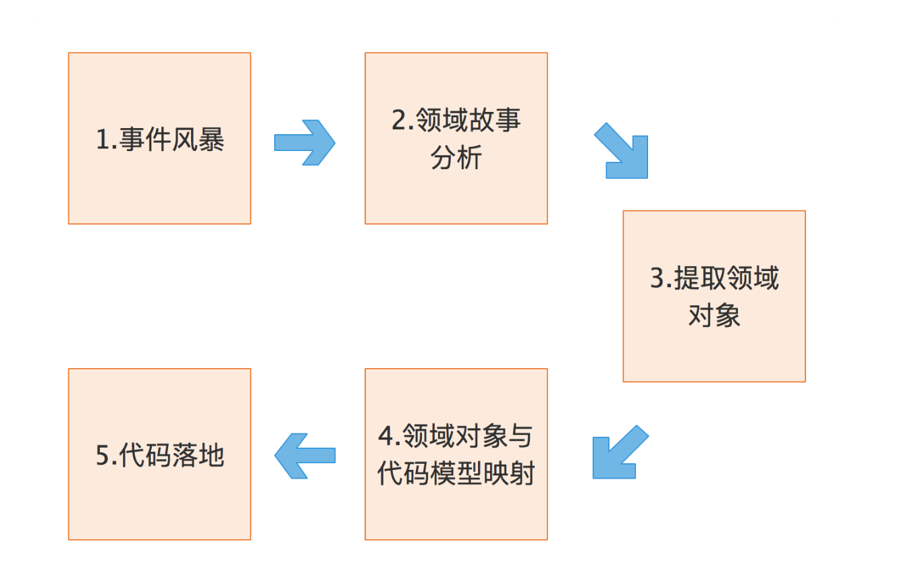

# 1、DDD的基本概念
- 聚合:高内聚、低耦合，它是领域模型中最底层的边界。
- 聚合根：聚合根是实体，有实体的特点，具有全局唯一标识，有独立的生命周期。
- 一个聚合只有一个聚合根，聚合根在聚合内对实体和值对象采用直接对象引用进行组织和协调
聚合根与聚合根之间通过id关联
- 实体：有ID标识，通过ID判断相等性，状态可变，依附于聚合根，其生命周期
由聚合根管理。
- 值对象：无ID，不可变，无嵊州周期，用完即扔。值对象之间通过属性值判断相等性。

# 2、怎么设计聚合？
- 采用事件风暴，根据业务行为，梳理业务过程中产生的对应的实体和值对象
- 从众多实体中选出适合作为对象管理者的根实体，也就是聚合根
> 判断怎么作为聚合根：
> 是否有独立的生命周期、是否有全局唯一ID、是否可以创建或修改其它对象
> 是否有专门的模块来管这个实体
- 根据业务单一职责和高内聚原则，找出与聚合根关联的所有紧密依赖的实体和值对象

- 在聚合内根据聚合根、实体和值对象的依赖关系，画出对象的引用和依赖模型
- 多个聚合根据业务语义和上下文一起划分到同一个限界上下文内。

# 3、聚合的设计原则
- 1、在一致性边界内建模真正的不变条件。聚合用来封装真正的不变性；有一套不变的业务规则
- 2、设计小聚合
- 3、通过唯一标识引用其它聚合
- 4、在边界之外使用最终一致性。聚合内数据强一致性，而聚合之间数据最终一致性。
- 5、通过应用层实现跨聚合的服务调用

# 4、进行DDD的简易步骤

- 1、在事件风暴中梳理业务过程中的用户操作、事件以及外部依赖关系等，根据这些要素梳理出领域实体等领域对象。
可以采用用例分析、场景分析和用户旅程分析等方法，通过头脑风暴列出所有可能的业务行为和事件，然后找出产生这些行为的领域对象
- 2、根据领域实体之间的业务关联性，将业务紧密相关的实体进行组合形成聚合，同时确定聚合中的聚合根、值对象和实体。
- 3、根据业务及语义边界等因素，将一个或者多个聚合划定在一个限界上下文内，形成领域模型。