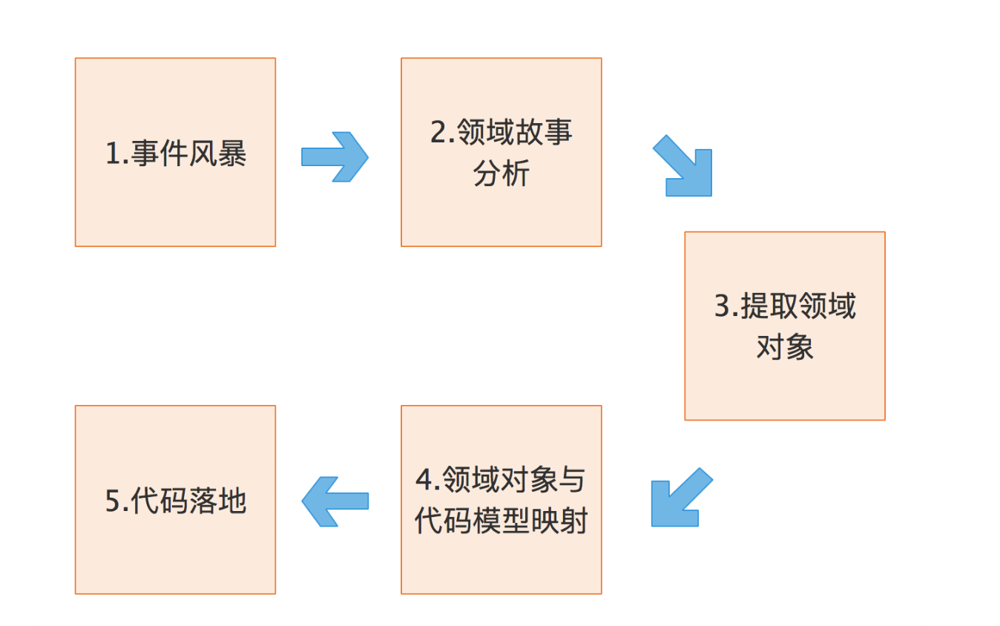

# 1、DDD的基本概念
- 聚合:高内聚、低耦合，它是领域模型中最底层的边界。
- 聚合根：聚合根是实体，有实体的特点，具有全局唯一标识，有独立的生命周期。
- 一个聚合只有一个聚合根，聚合根在聚合内对实体和值对象采用直接对象引用进行组织和协调
聚合根与聚合根之间通过id关联
- 实体：有ID标识，通过ID判断相等性，状态可变，依附于聚合根，其生命周期
由聚合根管理。
- 值对象：无ID，不可变，无嵊州周期，用完即扔。值对象之间通过属性值判断相等性。

# 2、怎么设计聚合？
- 采用事件风暴，根据业务行为，梳理业务过程中产生的对应的实体和值对象
- 从众多实体中选出适合作为对象管理者的根实体，也就是聚合根
> 判断怎么作为聚合根：
> 是否有独立的生命周期、是否有全局唯一ID、是否可以创建或修改其它对象
> 是否有专门的模块来管这个实体
- 根据业务单一职责和高内聚原则，找出与聚合根关联的所有紧密依赖的实体和值对象

- 在聚合内根据聚合根、实体和值对象的依赖关系，画出对象的引用和依赖模型
- 多个聚合根据业务语义和上下文一起划分到同一个限界上下文内。

# 3、聚合的设计原则
- 1、在一致性边界内建模真正的不变条件。聚合用来封装真正的不变性；有一套不变的业务规则
- 2、设计小聚合
- 3、通过唯一标识引用其它聚合
- 4、在边界之外使用最终一致性。聚合内数据强一致性，而聚合之间数据最终一致性。
- 5、通过应用层实现跨聚合的服务调用

# 4、进行DDD的简易步骤

- 1、在事件风暴中梳理业务过程中的用户操作、事件以及外部依赖关系等，根据这些要素梳理出领域实体等领域对象。
可以采用用例分析、场景分析和用户旅程分析等方法，通过头脑风暴列出所有可能的业务行为和事件，然后找出产生这些行为的领域对象
- 2、根据领域实体之间的业务关联性，将业务紧密相关的实体进行组合形成聚合，同时确定聚合中的聚合根、值对象和实体。
- 3、根据业务及语义边界等因素，将一个或者多个聚合划定在一个限界上下文内，形成领域模型。

# 5、使用DDD的好处
- 1、遏制“大泥球”的腐败扩散（战略价值）：通过限界上下文（Bounded Context），DDD强迫你在架构层面划清物理边界。
好处：当业务调整时，你只需要修改一个上下文内的代码，而不会牵一发动全身，有效降低了测试回归的成本。
- 2、将“隐形知识”显性化（战术价值）：传统的贫血模型（Service + DO）让业务规则散落在Service层或工具类中，新人根本不敢动。DDD要求将核心业务规则封装在实体（Entity）和值对象（Value Object）的行为方法里。
好处：单元测试变得极其容易——你只需new一个实体，调用其方法，无需启动Spring容器，几毫秒就能验证核心算法规格。
- 3、拒绝“技术绑架”业务：聚合根（Aggregate Root）作为唯一入口，隔绝了外部对内部子对象的直接操作。这意味着，不管你底层是用Hibernate、Mybatis还是JOOQ，业务代码（Domain层）完全不用变。

# 6、聚合与聚合根设计的铁律（实战依据）
- 1、核心依据：原子性事务边界（最硬核指标）：
  依据：在一次用户请求中，只能对一个聚合实例进行修改。如果要同时修改两个聚合，必须使用最终一致性（领域事件）。
  实战推演：在“订单”和“库存”关系中，如果扣减库存必须和创建订单在同一个数据库本地事务中完成（强一致），那么它们必须属于同一个聚合，订单是根。但如果允许“先下单后异步扣减”，那它们就是两个独立的聚合，通过事件解耦。
- 2、核心依据：业务不变量（Invariants）的保护伞
  依据：聚合根必须保证其内部所有子实体在任何状态下，都满足核心业务规则。
  实战推演：一个Order聚合内有多个OrderItem。业务规则是“总金额不能超过100万”。此时，Order必须是聚合根。当外部调用order.addItem(item)时，Order根内部会遍历并计算总价。禁止绕过根直接去修改OrderItem的金额，否则不变量就被破坏了。谁负责保护这个规则，谁就是根。
- 3、依据：生命周期（Lifecycle）的归属感
  依据：如果A不存在，B就没有任何存在的意义，那么A是根，B是其内部实体。
  实战推演：Aggregate Root是通过Repository（仓储）进行查询和删除的唯一入口。你只能orderRepository.save(order)，而不能单独去itemRepository.save(item)。如果某个子对象在界面上经常被单独查询（如商品快照），那它极大概率不应该藏在这个聚合内部，而应独立成一个聚合或读模型（CQRS）。
- 4、依据：引用通过ID，而非对象指针（Java架构师的警示）
  依据：聚合之间严禁持有对方实体对象的引用（避免Hibernate懒加载异常和跨库事务）。
  实战推演：Order聚合根中，如果需要关联User，聚合根里存的应该是userId（String或Long），绝不能存User user对象。这既是物理层（微服务拆分）的解耦需求，也是逻辑上划分聚合边界的依据——聚合通过ID关联，意味着它们之间没有强一致性契约。
