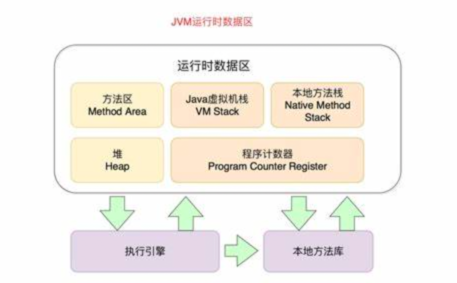
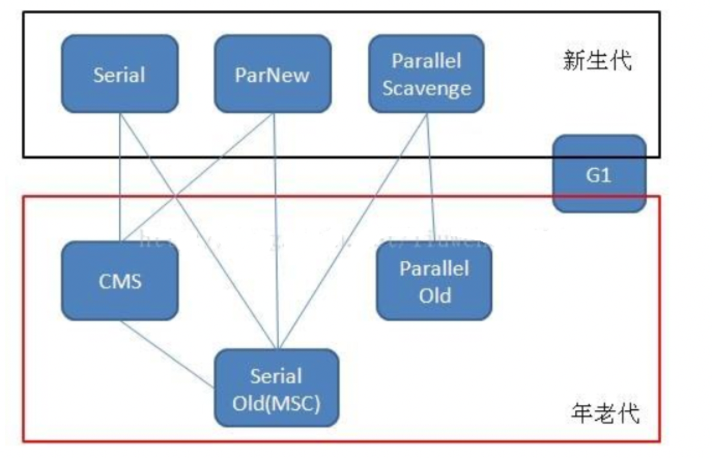

# 1、JDK和JRE的区别？ 
> JRE是java运行时环境，包含了java虚拟机，java基础类库。如果想要运行一个开发好的java程序，计算机中只需要安装JRE即可。
> 
> JDK是整个java开发的核心，如果想要开发java程序，需要安装JDK。
> 
> JDK包含了JRE，同时还包含了编译java源码的编译器javac，还包含了很多java程序调试和分析的工具（jdb，jps，jstack，jstat等）。
> 
> JDK是java开发的核心，JRE是java运行的核心。JDK包括JRE
# 2、JVM运行时数据区包括哪些内容？

> 1、程序计数器：是一块较小的内存空间，可以看做是当前线程所执行的字节码的行号指示器。字节码解释器工作时就是通过改变这个计数器的值来选取下一条需要执行的字节码指令，
> 分支、循环、跳转、异常处理、线程恢复等基础功能都需要依赖这个计数器来完成。
> 
> 2、java虚拟机栈：与程序计数器一样，也是线程私有的，生命周期与线程相同。
> 虚拟机栈描述的是java方法执行的内存模型：每个方法被执行的时候都会同时创建一个栈帧用于存储局部变量表、操作数栈、动态链接、方法出口等信息。
> 
> 3、本地方法栈：与虚拟机栈所发挥的作用是非常相似的，区别是虚拟机栈为虚拟机执行java方法服务，而本地方法栈则为虚拟机使用到的Native方法服务。
> 
> 4、java堆：java堆是被所有线程共享的一块内存区域，在虚拟机启动时创建。此内存区域的唯一目的就是存放对象实例，几乎所有的对象实例都在这里分配内存。
> 
> 5、方法区：方法区与java堆一样，是各个线程共享的内存区域，它用于存储已被虚拟机加载的类信息、常量、静态变量、即时编译器编译后的代码等数据。
>
- JDK1.7之前，方法区位于永久代，使用的是堆内存，永久代的垃圾回收主要回收常量池的回收和类型的卸载，
- 但是永久代的垃圾回收效率低下，容易出现OOM异常。
- 从JDK1.8开始，已经彻底废弃了永久代，使用元空间来代替。元空间与永久代相比，其最大的区别在于：元空间不在虚拟机中而是使用本地内存。
- 
> 
> 6、特殊部分：运行时常量池是方法区的一部分，用于存放编译期生成的各种字面量和符号引用
> ，这部分内容在类加载后进入方法区的运行时常量池中存放。
> 
> 其中：线程私有的是程序计数器、虚拟机栈、本地方法栈，线程共享的是java堆和方法区。
# 3、JVM在创建对象时，对象分配内存的方式有哪几种？
>  分配内存地址时，主要采用两种方式：指针碰撞和空闲列表。
> 
> 指针碰撞：内存空间中，已使用的内存和未使用的内存之间有一个指针作为分界点，指针之前的内存空间已被使用，指针之后的内存空间未被使用。（更高效）
> 
> 使用条件：内存空间中的内存是规整的，即已使用的内存和未使用的内存之间没有碎片。
> 
> 空闲列表：虚拟机会维护一个列表，来记录哪些内存是可以使用的，哪些内存是已经被使用的，当需要分配内存时，虚拟机会遍历这个列表，找到一个足够大的内存空间分配给对象。（更复杂）
> 
> 使用条件：内存空间中的内存是不规整的，即已使用的内存和未使用的内存之间有碎片。

# 4、在并发情况下如何保证分配内存地址的线程安全？
> 1、CAS+失败重试：在并发情况下，多个线程同时去分配内存地址，只有一个线程能够成功，其他线程会失败，失败的线程会进行重试，直到成功为止。
> 
> 2、本地线程分配缓冲：每个线程在java堆中预先分配一小块内存，称为本地线程分配缓冲，每个线程分配内存时，首先在本地线程分配缓冲中分配，
> 如果本地线程分配缓冲中的内存足够，就直接分配给线程，如果不够，就通过CAS+失败重试的方式分配内存。（是否使用TLAB：通过参数：-XX:+/-UseTLAB）

# 5、JVM中对象的内存布局是什么样的？
> 在JVM中，对象在内存中的布局分为三块区域：对象头、实例数据和对齐填充。
> 
> 对象头：对象头包含两部分信息：第一部分用于存储对象自身的运行时数据，如哈希码、GC分代年龄、锁状态标志、线程持有的锁、偏向线程ID、偏向时间戳等。
> 第二部分是类型指针，即对象指向它的类元数据的指针，虚拟机通过这个指针确定该对象是哪个类的实例。
> 
> 实例数据：实例数据是对象真正存储的有效信息，也是在程序中所定义的各种类型的字段内容。
> 
> 对齐填充：对齐填充并不是必然存在的，也没有特别的含义，仅仅起着占位符的作用。因为虚拟机要求对象的起始地址必须是8字节的整数倍，
> 而对象头部分正好是8字节的倍数（1倍或2倍），因此当对象实例数据部分没有对齐时，就需要通过对齐填充来补全。

# 6、JVM中对象的访问定位方式有哪几种？
> 1、句柄访问：java堆中划分出一块内存作为句柄池，reference中存储的是对象的句柄地址，句柄中包含了对象实例数据与类型数据各自的具体地址信息。
>
> 2、直接指针访问：java堆中直接存储对象的实例数据，reference中存储的是对象的地址。

# 7、虚拟机栈什么情况下会出现StackOverflowError异常？
> 1、线程请求的栈深度大于虚拟机所允许的最大深度，会抛出StackOverflowError异常。
> 
> 2、局部变量表中的局部变量所需的内存空间大于虚拟机所允许的最大空间，会抛出StackOverflowError异常。

# 8、如何判断对象是否可以被回收？
> 引用计数法：给对象添加一个引用计数器，每当有一个地方引用它时，计数器值加1，当引用失效时，计数器值减1，
> 任何时刻计数器为0的对象就是不可能再被使用的。
> 
> 存在的问题：无法解决对象之间相互循环引用的问题。（通过判断是否有环可以解决，只是JVM并未采用这种方法）
> 
> 可达性分析：通过一系列的称为“GC Roots”的对象作为起始点，从这些节点开始向下搜索，搜索所走过的路径称为引用链，
> 当一个对象到GC Roots没有任何引用链相连时，则证明此对象是不可用的。
> 
> JVM使用的就是可达性分析算法来判断对象是否存活的。

# 9、那么对象可以作为GC ROOT?
> 1、虚拟机栈中引用的对象。
> 
> 2、方法区中类静态属性引用的对象。
> 
> 3、方法区中常量引用的对象。
> 
> 4、本地方法栈中JNI（Native方法）引用的对象。
> 
> 5、java虚拟机内部的应用，如基本数据类型对应的Class对象，一些常驻的异常对象（如NullPointException、OutOfMemoryError）等，
> 以及系统类加载器。
> 
> 6、被同步锁持有的对象。
> 
> 7、反映java虚拟机内部情况的JMXBean、JVMTI中注册的回调、本地代码缓存等。
> 
> 8、在分代收集或者局部回收时，为了解决跨代引用，可能会把关联区域的对象加入到GC Root中

# 10、JVM中的引用有哪几种？
> 1、强引用：强引用是指在程序代码中普遍存在的，类似“Object obj = new Object()”这类的引用，
> 只要强引用还存在，垃圾收集器就永远不会回收掉被引用的对象。
> 
> 2、软引用：软引用是用来描述一些还有用但并非必须的对象，只有当内存不足时，系统才会回收软引用对象。
> 
> 3、弱引用：弱引用也是用来描述一些还有用但并非必须的对象，弱引用比软引用更弱一些，
> 被弱引用关联的对象只能生存到下一次垃圾收集发生之前。
> 
> 4、虚引用：虚引用也称为幽灵引用或者幻影引用，它是最弱的一种引用关系，一个对象是否有虚引用的存在，
> 完全不会对其生存时间构成影响，也无法通过虚引用来取得一个对象实例。（唯一的作用就是对象被回收时，会收到一个系统通知）

# 11、finalize()方法有什么作用？
> finalize()方法是Object类中的一个方法，当垃圾收集器将要回收对象所占内存之前会先调用该方法，
> 
> 该方法允许对象在被回收之前进行自救，即重新与引用链上的任何一个对象建立关联关系。
> 
> finalize()方法只会被系统调用一次。
> 
> 该方法的执行时间是不确定的，有可能执行很快，也有可能执行很慢，甚至有可能永远不执行。该方法的执行是由垃圾收集器触发的，程序员无法精确控制。

# 12、方法区中类信息何时会被卸载？
> 1、该类所有的实例都已经被回收，也就是java堆中不存在该类的任何实例。
> 
> 2、加载该类的ClassLoader已经被回收。
> 
> 3、该类对应的java.lang.Class对象没有任何地方被引用，无法在任何地方通过反射访问该类的方法。
> 
> 满足以上三个条件都满足，虚拟机也不一定会对类信息进行回收，虚拟机提供了-Xnoclassgc参数来控制是否对类信息进行回收。

# 13、垃圾收集算法有哪几种？
> 1、标记-清除算法：标记出所有需要回收的对象，在标记完成后统一回收所有被标记的对象。（CMS垃圾收集使用的此方法）
> 
> 存在的问题：效率问题，标记和清除两个过程的效率都不高，会存在大量的空间碎片。
> 
> 2、复制算法：将可用内存按容量划分为大小相等的两块，每次只使用其中一块，当这一块内存用完了，就将还存活的对象复制到另一块上面，
> 然后再把已使用过的内存空间一次清理掉。（一般新生代使用的垃圾收集算法、同时为了解决空间利用率问题：疯了Eden区和两个Survive区
> 比例为8：1）
> 
> 存在的问题：内存缩小为原来的一半，空间利用率低。
> 
> 3、标记-整理算法：标记出所有需要回收的对象，在标记完成后，让所有存活的对象都向一端移动，然后直接清理掉端边界以外的内存。
> 
> 
> 存在的问题：会移动对象。

# 14、进行分代回收时，如何解决跨代引用问题？
> 有一个全局的数据结构（Remembered Set）"记忆集"，当发生Minor GC时，包含了跨代引用的内存区域的对象会被放入到GC Root进行扫描。

# 15、什么是safePoint？
> 在程序执行过程中，有些地方需要让程序暂停下来，然后等待其他线程完成特定的工作后再继续执行，这些地方称为safePoint。
> 只有用户线程执行的程序运行到safePoint时，用户线程才能暂停，然后进行垃圾收集工作。
> 
> 常被作为检查点的地方有：方法调用、循环跳转、异常跳转、线程创建、线程终止、对象的创建和回收、调用JNI方法等。

# 16、什么是安全点的中断？
> 当用户线程运行到safePoint时，如果发现没有可用的空闲线程来执行垃圾收集工作，那么就会发生安全点的中断，
> 用户线程会被中断，让出cpu资源，让垃圾收集线程来执行垃圾收集工作。

# 17、什么是安全区域？
> 主要是针对当用户线程不执行时，无法到达安全点时，就引入了安全区域的概念。
> 安全区域是指在一段代码片段中，引用关系不会发生变化，即使发生了垃圾收集，也不会对引用关系产生影响。

# 18、什么是可数循环和不可数循环？
> 可数循环：使用int类型或者范围更小的数据类型作为作为循环判断时，默认不放置检查点。
> 
> 不可数循环：使用long类型或者范围更大的数据类型作为循环判断时，默认放置检查点。

# 19、JVM 有哪些垃圾回收器？

> 1、Serial收集器（复制算法): 新生代单线程收集器，标记和清理都是单线程，优点 是简单高效；
> 
> 2、ParNew收集器 (复制算法): 新生代收并行集器，实际上是Serial收集器的多线程 版本，在多核CPU环境下有着比Serial更好的表现；
> 
> 3、arallel Scavenge收集器 (复制算法): 新生代并行收集器，追求高吞吐量，高效 利用 CPU。吞吐量 = 用户线程时间/(用户线程时间+GC线程时间)，高吞吐量可以高 效率的利用CPU时间，尽快完成程序的运算任务，适合后台应用等对交互相应要求不 高的场景；
> 
> 4、Serial Old收集器 (标记-整理算法): 老年代单线程收集器，Serial收集器的老年 代版本；
> 
> 5、Parallel Old收集器 (标记-整理算法)： 老年代并行收集器，吞吐量优先， Parallel Scavenge收集器的老年代版本；
> 
> 6、CMS(Concurrent Mark Sweep)收集器（标记-清除算法）： 老年代并行收集 器，以获取最短回收停顿时间为目标的收集器，具有高并发、低停顿的特点，追求最 短GC回收停顿时间。
> 
> 7、G1(Garbage First)收集器 (标记-整理算法)： Java堆并行收集器，G1收集器是 JDK1.7提供的一个新收集器，G1收集器基于“标记-整理”算法实现，也就是说不会 产生内存碎片。此外，G1收集器不同于之前的收集器的一个重要特点是：G1回收的范围是整个Java堆(包括新生代，老年代)

#20、Minor GC 和 Full GC 有什么区别？
> Minor GC：指发生在新生代的垃圾收集动作，因为Java对象大多都具备朝生夕灭的特性，所以Minor GC非常频繁，一般回收速度也比较快。
> 
> Major GC/Full GC: 是指发生在老年代的 GC，出现了 Major GC 通常会伴 随至少一次 Minor GC。Major GC的速度通常会比 Minor GC 慢 10 倍以上.

# 21、对象什么情况下会晋升到老年代？
> 长期存活的对象，将会进入到老年代，对象在Eden区出生并经过第一次Minor GC后仍然存活，并且能被Survivor容纳的话，将被移动到Survivor区，对象年龄设为1岁,
> 当年龄达到一定程度（默认 15 可以通过-XX：MaxTenuringThreshold设置）就会被晋升 到老年代。
> 
> 大对象直接进入老年代,-XX:PretenureSizeThreshold参数设置大于该参数值的对象直接在老年代分配，避免在Eden区和Survivor区之间的大量内存拷贝。
> 
> 当Eden区分配没有足够的空间进行分配时，虚拟机将会发起一次Minor GC。如果本次GC后还是没有足够的空间，
> 则将启用分配担保机制在老年代中分配内存，或者在进行Minor GC时，survivor空间无法容纳一次Minor GC后存活的对象，那么这些对象将直接进入老年代。
>
> 动态年龄判断，如果在Survivor空间中相同年龄所有对象大小的总和大于Survivor空间的一半，年龄大于或等于该年龄的对象就可以直接进入老年代，无需等到MaxTenuringThreshold中要求的年龄。

# 22、什么情况下会触发Full GC？
> 调用System.gc()时，系统建议执行Full GC，但是不必然执行.
> 
> 未指定老年代和新生代大小，堆伸缩时会产生fullgc
> 
> 老年代空间不足
> 
> 空间分配担保失败 每次晋升的对象的平均大小 > 老年代剩余空间,Minor GC后存活的对象超过了老年代剩余空间
> 
> JDK1.7之前，永久代空间不足

