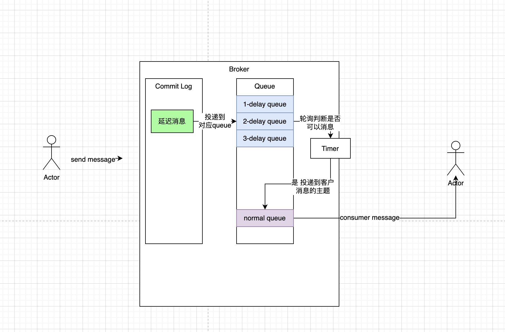

# 1、RocketMQ如何实现延迟投递的？

> 首先RocketMQ本身有18个等级的延迟队列来存储消息，当我们设置了延迟投递的等级后
> 消息就会按设置的等级投递到对应的延迟TOPIC中。
> 
> 然后RocketMQ会为每延迟队列设置一个Timer，通过Timer轮询消息，来判断对应的
> 消息是否可以进行投递。
> 
> 如果可以进行投递，会将这条消息在重新发送到对应的客户端消费的topic中。