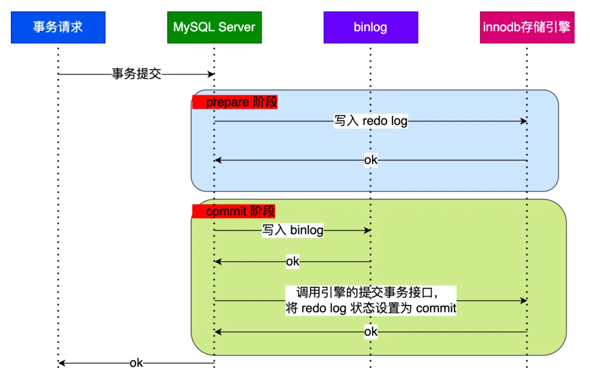

# 1、使用自增主键增长到最大值后会怎么样？
- 当使用int或者bigint作为自增主键时，当达到最大值时，下次在
申请的主键还是最大值，那么在插入的时候就会报主键冲突。
- 当没有指定自增主键时，mysql默认会为我们生成一个row_id作为主键，row_id的最大值为2^48 - 1
当达到最大值后，再次申请的row_id会从0再次开始循环，并且数据会覆盖之前已存在的数据，不会报错
（这就会导致数据丢失）

# 2、采用主从架构时，如果解决从库读取延迟问题？
- 最简单的方式，对于需要马上获取到最新的结果的数据，直接走主库查询，不走从库查询
- 判断主从无延迟方案：只能报错数据发送到从库，从库已经执行完成的情况，但是对于主库执行完成后，还未将binlog进行同步的情况
还是存在延迟读问题。
  - 每次在从库执行查询语句前，执行命令show slave status,查看seconds_behind_master是否为0，如果为0无延迟
  - 对比位点确保没有主备延迟：通过Master_Log_File（主日志文件）Read_Master_Log_Pos（读到的主库最新位点）和Relay_Master_Log_File（从库接受到的主库日志文件）Exec_Master_Log_Pos
（从库读到的最新位点）；Master_Log_File 和 Relay_Master_Log_File、Read_Master_Log_Pos 和 Exec_Master_Log_Pos 这两组值完全相同，表示没有延迟。
  - 对比GTID集合，首先需要开启了GTID，在show slave status中Auto_Position=1表示开启了GTID，判断Retrieved_Gtid_Set（备库收到的GTID集合）
    Executed_Gtid_Set（备库已经执行的GTID集合）相等，无延迟
- 半同步机制semi-sync：当一个更新在主库完成后，将binlog发送给从库，从库收到binlog日志后，回复一个ack给主库，主库才认为
这次更新完成。通过semi-sync + 位点判断，解决延迟读取问题。
- 等主库位点：通过如下命令,
  - 当一个更新事务在主库上完成后，执行show master status 得到当前主库执行到的File和Position
  - 选择一个从库执行 select master_pos_wait(file, pos[, timeout]);
  - 如果返回值是 >=0 的正整数，则在这个从库执行查询语句
  - 不然就降级到主库上进行查询
```sql
# 在从库执行如下命令，其中file 和 pos 指的是主库上的日志文件名和位点，timeout可选值，语句执行等待时间
# 命令执行结果会
    · 正常返回一个正整数
    · 执行期间，备库同步线程发生异常，则返回 NULL
    · 等待超过 timeout 秒，就返回 -1
    · 刚开始执行的时候，就发现已经执行过这个位置了，则返回 0
select master_pos_wait(file, pos[, timeout]);

```
- GTID方案:前提是数据库已经开启了GTID
  - 在主库上执行一条更新事务后，获取到对应GTID值
  - 根据这个值，选择一个从库执行select wait_for_executed_gtid_set(gtid1, 1)；
  - 返回值为0，则在从库进行查询
  - 其他值，则到主库上进行查询
```sql
# 个库执行的事务中包含传入的 gtid_set，返回 0，否则超时返回1
# 在mysql5.7.6 版本之后，允许执行万更新语句后，返回对应的事务的GTID，
# 这样可以减少使用show master status命令
select wait_for_executed_gtid_set(gtid_set, 1);
```
# 3、如果表A两条数据，表B有两条数据，那么语句 select * from A left join B on A.param = B.param 可能有几条结果？
> 答案：2~4条
> 
> 2条的情况：如果表A和表B两个关联的数据不相等，或者刚好一一对应，那么返回的结果就是2条
> 
> 3条的情况：如果表A中的两个数据不一致，其中一条数据和表B刚好都匹配，则返回3条数据。
> 
> 4条的情况：如果表A中的数据相同并且都能和表B的数据都能匹配上，返回的结果为4条

# 4、如果表A两条数据，表B有两条数据，那么语句 select * from A inner join B on A.param = B.param 可能有几条结果？
> 答案:0、1、2、4条
> 
> 0条的情况： 如果A B关联的字段两个表的数据不相等。
> 
> 1条的情况：如果A B关联是字段刚好有一条数据A B字段相同。
> 
> 2条的情况：如果A B关联的字段刚好两张表字段一一对应，或者A中一条数据对应B中两条数据
> 
> 4条的情况：如果A的关联字段值相同，切和B中两条数据都相同，则返回4条。

# 5、有了Binlog为什么还需要有redo log,binlog和redo log怎么保证数据一直性？
> redo是innodb存储引擎的日志，binlog是mysql server端的日志，redo log 可以进行wal(Write Ahead Log)预写日志。
> 当一条数据更新时，会先写入redo log（prepare）状态，在写入binlog，然后再提交redo log（commit）状态 - 这就是两阶段提交流程

> 如果在进行事务写入的时候mysql宕机了，进行进行数据恢复呢？
- 如果是在redo log（prepare）阶段，还没写入binlog，会根据redo log记录的XID去查询binlog如果没有就丢弃这条数据
- 如果是在binlog写入后，redo log（commit）阶段宕机了，那么会根据redo log记录的XID去查询binlog，如果有就进行数据恢复
- 如果是在redo log（commit）阶段宕机了，binlog也写入了，那么会根据redo log记录的XID去查询binlog，如果有就进行数据恢复
- 所以进行数据恢复时，实际是已是否写入了binlog为准，只要binlog写入，这个数据就可以恢复，如果没有写入，则需要抛弃这条数据。

# 6、两阶段提交会有什么问题？
> 为了保证每个事务的持久化，我们需要配置innodb_flush_log_at_trx_commit = 1 并且 sync_binlog = 1的双一配置，这样一个事务提交就需要进行两次刷盘（redo + binlog）

# 7、怎么解决双1下的IO瓶颈
> 就是引入组提交，当有多个事务提交时，会将多个 Binlog 刷盘操作合并成一个，以减少磁盘 I/O 次数。
> 因为持久化操作主要分为write和fsync,write操作主要是将数据写入到操作系统的文件系统缓存中，fsync操作才是真正将数据写入到磁盘中


# 8、针对binlog和redo的刷盘有哪些参数配置？
> 针对binlog刷盘主要由sync_binlog参数控制
- sync_binlog=0 的时候，表示每次提交事务都只 write，不 fsync（可能会存在事务丢失的情况）
- sync_binlog=1 的时候，表示每次提交事务都会执行 fsync
- sync_binlog=N(N>1) 的时候，表示每次提交事务都 write，但累积 N 个事务后才 fsync（可能丢失N个事务数据）
> 针对redo刷盘主要由innodb_flush_log_at_trx_commit参数控制
- innodb_flush_log_at_trx_commit = 0 的时候，表示每次事务提交时都只是把redo log留在redo log buffer中，InnoDB有一个后台线程，每隔1秒，就会把redo log buffer中的日志，调用write写到文件系统的page cache，然后调用fsync持久化到磁盘
> 其中redo log buffer里的数据可能是某些事务中间过程的redo log，也会被持久化到磁盘,
- innodb_flush_log_at_trx_commit = 1 的时候，表示每次事务提交时都将 redo log 直接持久化到磁盘
- innodb_flush_log_at_trx_commit = 2 的时候，表示每次事务提交时都只是把 redo log 写到 page cache

# 9、redo log和binlog通过什么进行关联？
> 它们有一个共同的数据字段，叫 XID

# binlog日志，怎么确定是一个完整事务提交？
- statement 格式的 binlog，最后会有 COMMIT；
- row 格式的 binlog，最后会有一个 XID event