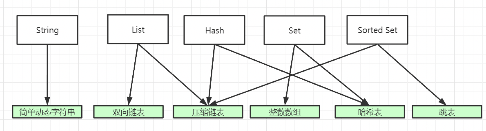
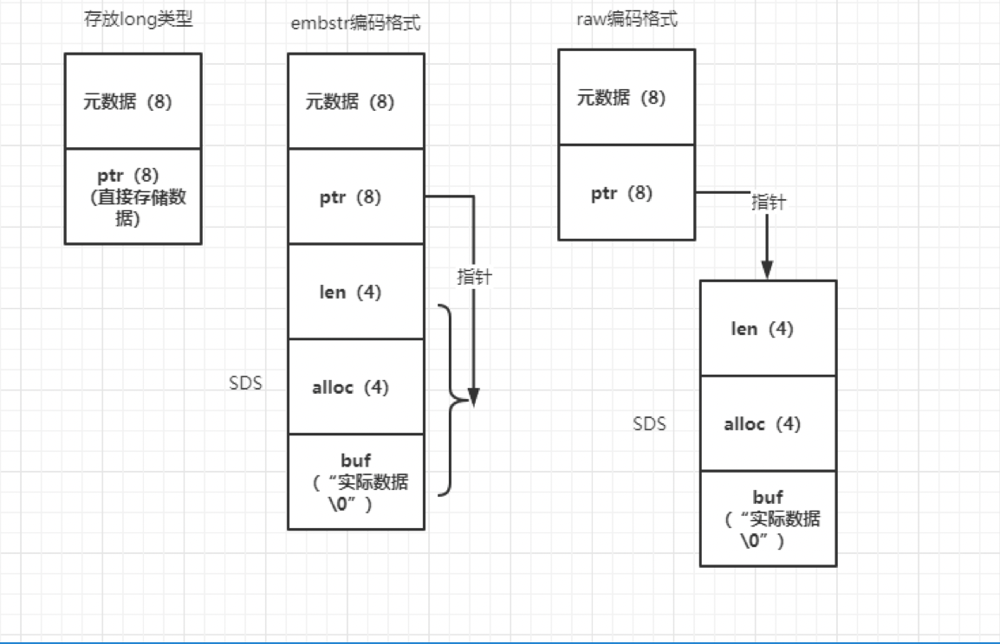
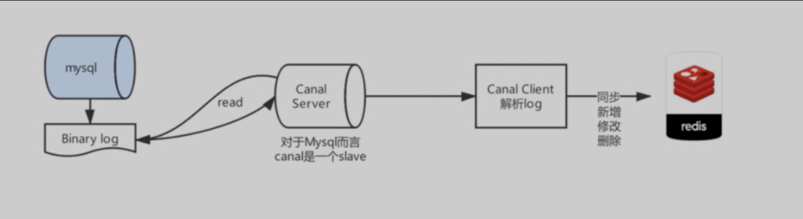
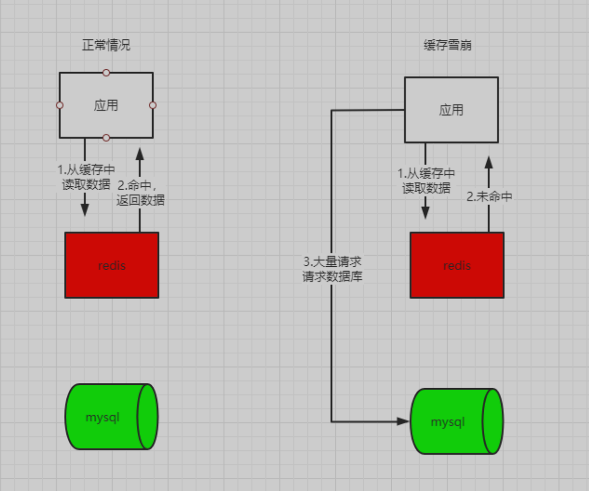
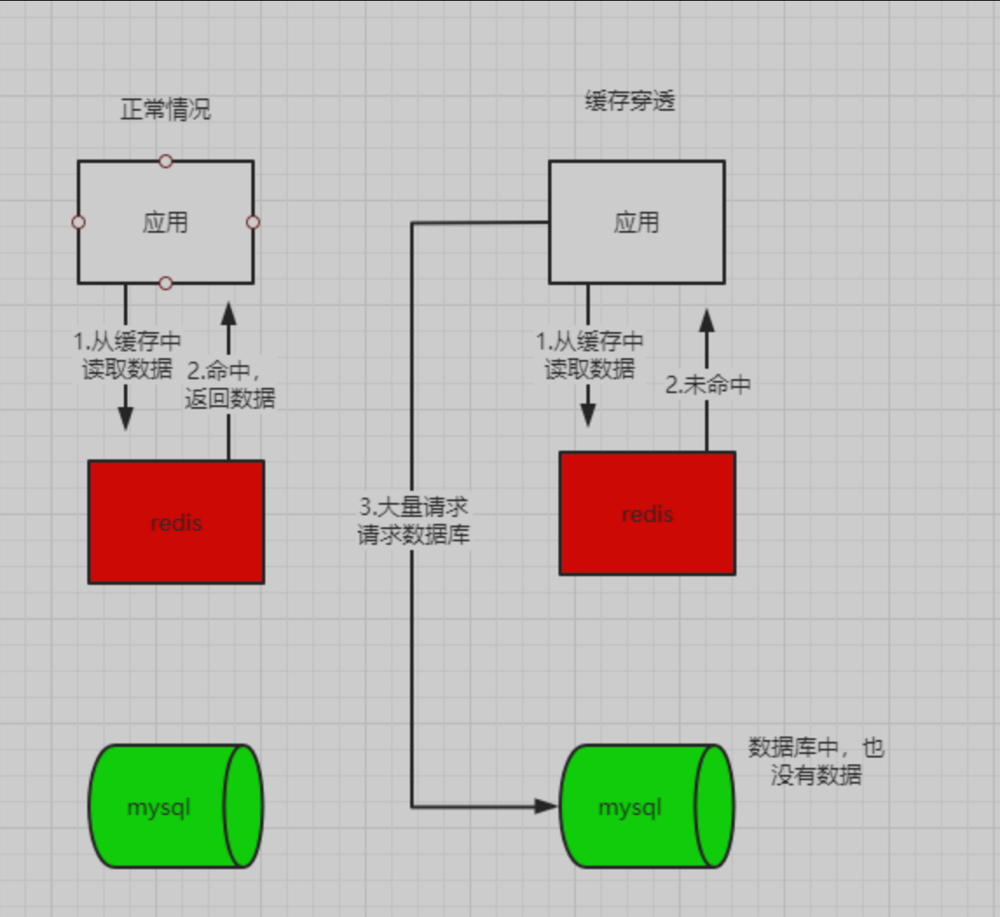

# 1、redis都有哪些数据结构？

> 常见的五大基本数据结构：String,List,Map,Set,Sort Set;
- String：底层采用简单动态字符串（SDS）
- List:底层是（双向链表和压缩链表）
- Hash:底层是（压缩链表和哈希表）
- Set:底层是（整数数组和哈希表）
- Sorted Set:底层（压缩链表和跳表）
> 其他结构：bitmap, GEO,HyperLogLog, Stream
# 2、什么是SDS？redis为什么不直接使用char*？
```C
struct __attribute__ ((__packed__)) sdshdr16 {
    uint16_t len; /* used */
    uint16_t alloc; /* excluding the header and null terminator */
    unsigned char flags; /* 3 lsb of type, 5 unused bits */
    char buf[];
}
// __attribute__ ((__packed__))的作用
// 编译器，在编译 sdshdr16 结构时，不要使用字节对齐的方式，而是采用紧凑的方式分配内存
```
- len：字符数组现有长度
- alloc：字符数组分配的空间长度
- flags：SDS类型(sdshdr5、sdshdr8、sdshdr16、sdshdr32 和 sdshdr64)
- buf[]：字符数组
```c
struct redisObject {
    unsigned type:4;
    unsigned encoding:4;
    unsigned lru:LRU_BITS; /* LRU time (relative to global lru_clock) or
                            * LFU data (least significant 8 bits frequency
                            * and most significant 16 bits access time). */
    int refcount;
    void *ptr;
};
```
- type: redisObject 的数据类型，是应用程序在 Redis 中保存的数据类型，包括 String、List、Hash 等
- encoding: redisObject 的编码类型，是 Redis 内部实现各种数据类型所用的数据结构。如SDS、dict 等
- lru: redisObject 的 LRU 时间 24个bit
- refcount: redisObject 的引用计数。4字节
- *ptr: 指向值的指针。8字节
```cassandraql
#define OBJ_ENCODING_EMBSTR_SIZE_LIMIT 44
robj *createStringObject(const char *ptr, size_t len) {
    if (len <= OBJ_ENCODING_EMBSTR_SIZE_LIMIT)
        return createEmbeddedStringObject(ptr,len);
    else
        return createRawStringObject(ptr,len);
}
// 从源码中知道
// 当字符长度小于44字节时，采用的emb、超过44采用的时raw
```
> 总结：C语言底层的字符数组，结尾必须为"\0"来表示结尾，这样就不能保存
> 任意二进制的数据，所以redis使用SDS来进行String的底层数据结构。
> 在redis中，所有对象都是通过redisObject来进行封装的，针对不同长度
> redisObject的*ptr有两种分配方式
- 当字符长度小于44时，redisObject和SDS的内存是一次分配在同一个内存区域，只需分配一次内存
- 及embstr模式
- 当字符长度大于44字节时，redisObject和SDS是分开分配，需要分配两次内存空间。及raw模式
- 如果string中存放的是long类型的数据，直接使用redisObject的*ptr而不需要在分配SDS的内存


# 3、为什么是根据字符长度44来区分的呢？
> 目前在x86的体系下，一个缓存行的大小是64字节
> redisObject本身需要16字节，
> 在SDS中sdshdr8（3 个字节）+ SDS 字符数组（N 字节 + \0 结束符 1 个字节）
> 64 - 16 - 3- 1 = 44字节

# 4、使用redis存在哪些问题？
> 常见的问题有：数据不一致问题、缓存穿透、缓存雪崩、缓存击穿
# 5、如果解决数据不一致问题
> 数据不一致产生的原因：
> 当有数据修改时，无论是先修改数据库的值，还是先修改缓存中的值，都会发生数据不一致的情况。
> 
> 根因：操作缓存和数据库不是原子操作。
> 
> 明确问题：使用了redis无法做到和数据库保持强一致性，所以的方案都只能保证最终一致性。
> 
> 解决方案：
> 
> 方案一：通过数据的binlog进行更新redis操作，如阿里开源的canal,
> 将解析的数据先存入消息中间件，然后在消费消息中间的数据来操作redis。
> 
> 
> 方案二：延迟双删，当一个线程需要更新数据库时，先删除缓存中的值，然后更新数据库，当更新完数据库后，
> sleep在进行一次删除缓存的动作。

# 6、如果解决缓存雪崩问题？
> 什么是缓存雪崩： 大量的数据在redis缓存中没有数据，导致请求打到数据库层，导致数据库请求压力大增。
> 
> 产生的原因：
> 
> 缓存中的数据，在某一个时候，数据大量过期
> 
> 缓存系统导致出现宕机。
> 
> 解决思路：一般需要从两个方面来回答，第一避免大面积的缓存数据过期；
> 当出现缓存雪崩时，如果保护底层数据库系统
> 
> 防止大面积缓存过期方法：针对数据的key，设置随机的过期时间，保证在某一时刻，不会存在大量的缓存失效。
> 
> 降级方案：对于非核心数据直接返回空，或者错误信息；并且对访问数据库进行限流，防止压垮数据库。

# 7、如果解决缓存穿透问题？
> 什么是缓存穿透：请求的数据，既不在redis缓存中，也不在数据库中，后续在查询这些数据时，依然无法命中缓存，导致需要运行整个流程，服务器处理无效请求，浪费资源。
> 
> 产生的原因：
> 
> 恶意攻击，请求的都是一些无效的数据。
> 
> 业务误操作，请求的是无用的数据；或者误删除一些数据，导致数据库和缓存中都没有了数据。
> 
> 
> 解决方案：
> 
> 缓存空值或者缺省值：也就是当缓存穿透时，查询数据没有值时，在缓存中缓存这个空值，或者给一个默认给定的值，当有这个无效数据再来访问时，可以命中缓存。
> 
> 使用布隆过滤器进行拦截，判断数据是否存在数据库中。

# 8、如果解决缓存击穿问题？
> 什么是缓存击穿：某些热点数据，在缓存中无法命中，导致大量请求打到数据库服务器，导致数据库压力大增，影响性能。
> 
> 解决方案：这种问题只要针对单个热点key就行访问，思路就是这个数据必须要在缓存中，
> 那么就是需要识别出哪些key是热点key，怎么保证这个key不过期？
> 
> 识别热点key，redis-server本身就会存储一个数据的访问次数，比如我们设置一个阈值，当
> 达到多少之后，就被标记为热点key，然后延长key的过期时间，保证key不过期。
> 
> 或者针对热点key，不设置过期时间。


