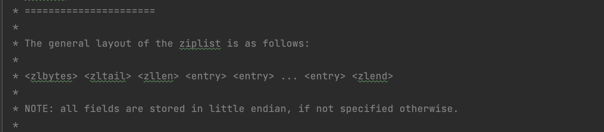

# 1、redis都有哪些数据结构？

> 常见的五大基本数据结构：String,List,Map,Set,Sort Set;
- String：底层采用简单动态字符串（SDS）
- List:底层是（双向链表和压缩链表）
- Hash:底层是（压缩链表和哈希表）
- Set:底层是（整数数组和哈希表）
- Sorted Set:底层（压缩链表和跳表）
> 其他结构：bitmap, GEO,HyperLogLog, Stream
# 2、什么是SDS？redis为什么不直接使用char*？
```C
struct __attribute__ ((__packed__)) sdshdr16 {
    uint16_t len; /* used */
    uint16_t alloc; /* excluding the header and null terminator */
    unsigned char flags; /* 3 lsb of type, 5 unused bits */
    char buf[];
}
// __attribute__ ((__packed__))的作用
// 编译器，在编译 sdshdr16 结构时，不要使用字节对齐的方式，而是采用紧凑的方式分配内存
```
- len：字符数组现有长度
- alloc：字符数组分配的空间长度
- flags：SDS类型(sdshdr5、sdshdr8、sdshdr16、sdshdr32 和 sdshdr64)
- buf[]：字符数组
```c
struct redisObject {
    unsigned type:4;
    unsigned encoding:4;
    unsigned lru:LRU_BITS; /* LRU time (relative to global lru_clock) or
                            * LFU data (least significant 8 bits frequency
                            * and most significant 16 bits access time). */
    int refcount;
    void *ptr;
};
```
- type: redisObject 的数据类型，是应用程序在 Redis 中保存的数据类型，包括 String、List、Hash 等
- encoding: redisObject 的编码类型，是 Redis 内部实现各种数据类型所用的数据结构。如SDS、dict 等
- lru: redisObject 的 LRU 时间 24个bit
- refcount: redisObject 的引用计数。4字节
- *ptr: 指向值的指针。8字节
```cassandraql
#define OBJ_ENCODING_EMBSTR_SIZE_LIMIT 44
robj *createStringObject(const char *ptr, size_t len) {
    if (len <= OBJ_ENCODING_EMBSTR_SIZE_LIMIT)
        return createEmbeddedStringObject(ptr,len);
    else
        return createRawStringObject(ptr,len);
}
// 从源码中知道
// 当字符长度小于44字节时，采用的emb、超过44采用的时raw
```
> 总结：C语言底层的字符数组，结尾必须为"\0"来表示结尾，这样就不能保存
> 任意二进制的数据，所以redis使用SDS来进行String的底层数据结构。
> 在redis中，所有对象都是通过redisObject来进行封装的，针对不同长度
> redisObject的*ptr有两种分配方式
- 当字符长度小于44时，redisObject和SDS的内存是一次分配在同一个内存区域，只需分配一次内存
- 及embstr模式
- 当字符长度大于44字节时，redisObject和SDS是分开分配，需要分配两次内存空间。及raw模式
- 如果string中存放的是long类型的数据，直接使用redisObject的*ptr而不需要在分配SDS的内存


# 3、为什么是根据字符长度44来区分的呢？
> 目前在x86的体系下，一个缓存行的大小是64字节
> redisObject本身需要16字节，
> 在SDS中sdshdr8（3 个字节）+ SDS 字符数组（N 字节 + \0 结束符 1 个字节）
> 64 - 16 - 3- 1 = 44字节

# 4、使用redis存在哪些问题？
> 常见的问题有：数据不一致问题、缓存穿透、缓存雪崩、缓存击穿
# 5、如果解决数据不一致问题
> 数据不一致产生的原因：
> 当有数据修改时，无论是先修改数据库的值，还是先修改缓存中的值，都会发生数据不一致的情况。
> 
> 根因：操作缓存和数据库不是原子操作。
> 
> 明确问题：使用了redis无法做到和数据库保持强一致性，所以的方案都只能保证最终一致性。
> 
> 解决方案：
> 
> 方案一：通过数据的binlog进行更新redis操作，如阿里开源的canal,
> 将解析的数据先存入消息中间件，然后在消费消息中间的数据来操作redis。
> 
> 
> 方案二：延迟双删，当一个线程需要更新数据库时，先删除缓存中的值，然后更新数据库，当更新完数据库后，
> sleep在进行一次删除缓存的动作。

# 6、如果解决缓存雪崩问题？
> 什么是缓存雪崩： 大量的数据在redis缓存中没有数据，导致请求打到数据库层，导致数据库请求压力大增。
> 
> 产生的原因：
> 
> 缓存中的数据，在某一个时候，数据大量过期
> 
> 缓存系统导致出现宕机。
> 
> 解决思路：一般需要从两个方面来回答，第一避免大面积的缓存数据过期；
> 当出现缓存雪崩时，如果保护底层数据库系统
> 
> 防止大面积缓存过期方法：针对数据的key，设置随机的过期时间，保证在某一时刻，不会存在大量的缓存失效。
> 
> 降级方案：对于非核心数据直接返回空，或者错误信息；并且对访问数据库进行限流，防止压垮数据库。

# 7、如果解决缓存穿透问题？
> 什么是缓存穿透：请求的数据，既不在redis缓存中，也不在数据库中，后续在查询这些数据时，依然无法命中缓存，导致需要运行整个流程，服务器处理无效请求，浪费资源。
> 
> 产生的原因：
> 
> 恶意攻击，请求的都是一些无效的数据。
> 
> 业务误操作，请求的是无用的数据；或者误删除一些数据，导致数据库和缓存中都没有了数据。
> 
> 
> 解决方案：
> 
> 缓存空值或者缺省值：也就是当缓存穿透时，查询数据没有值时，在缓存中缓存这个空值，或者给一个默认给定的值，当有这个无效数据再来访问时，可以命中缓存。
> 
> 使用布隆过滤器进行拦截，判断数据是否存在数据库中。

# 8、如果解决缓存击穿问题？
> 什么是缓存击穿：某些热点数据，在缓存中无法命中，导致大量请求打到数据库服务器，导致数据库压力大增，影响性能。
> 
> 解决方案：这种问题只要针对单个热点key就行访问，思路就是这个数据必须要在缓存中，
> 那么就是需要识别出哪些key是热点key，怎么保证这个key不过期？
> 
> 识别热点key，redis-server本身就会存储一个数据的访问次数，比如我们设置一个阈值，当
> 达到多少之后，就被标记为热点key，然后延长key的过期时间，保证key不过期。
> 
> 或者针对热点key，不设置过期时间。

# 9、list底层是什么数据结构实现的？什么时候使用ziplist什么时候使用linkedList
> 在redis中底层是通过双向链表或者压缩链表ziplist来实现list结构的。
> 
> 当list同时满足以下两个条件时，底层采用了ziplist来进行存储
- list对象保存的所有字符串元素的长度都小于64字节；（通过配置项list-max-ziplist-value控制）
- list对象保存的元素数量小于512个（通过配置项list-max-ziplist-entries）
# 10、什么是ziplist？
> 
> 看代码注解我们知道ziplist的结构如下图所示
> 
> 各字段含义如下
- zlbytes：表示ziplist的总字节数
- zltail：表示列表最后一个元素的偏移量
- zllen：表示列表中entry的数量
- zlend：用255来表示结束符
> 每个entry的元素含义如下
- prevlen:前一个entry的大小
  - 占用1字节：当前一个entry的大小小于254字节时，展示一个字节大小
  - 占用5字节：超过254字节时，取5字节，来表示前一个entry的大小
- encoding：表示当前entry长度编码方式，占用1字节
- len：表示自身长度，占4字节
- content:保存的实际数据
> ziplist存在问题：连锁更新问题；因为后一个entry记录前一个entry的大小，一开始如果
> 前一个entry的大小是253字节时，后面的prevlen只占用一个字节，当前面的entry超过254字节时，
> 会引发后面的entry也需要扩大容量，如果扩大的容量刚好也超过了254字节，那么会传递下去，引发
> 下一个字节的prevlen需要扩容，从而引发连续更新的问题。
> 
> 如果ziplist存在的数据太多，一会导致检索数据更加耗时，ziplist定位某个数据的时间复杂度为O(n)
# 11、什么是quicklist？
```c
typedef struct quicklistNode {
    struct quicklistNode *prev;         //前一个quicklistNode
    struct quicklistNode *next;         //后一个quicklistNode
    unsigned char *zl;                  //quicklistNode指向的ziplist
    unsigned int sz;                    //ziplist的字节大小
    unsigned int count : 16;            //ziplist中的元素个数 
    unsigned int encoding : 2;          //编码格式，原生字节数组或压缩存储
    unsigned int container : 2;         //存储方式
    unsigned int recompress : 1;        //数据是否被压缩
    unsigned int attempted_compress : 1; //数据能否被压缩
    unsigned int extra : 10;            //预留的bit位
} quicklistNode;
```
> quicklist其实是实现list底层的一种数据结构。list底层实现已经有了ziplist和链表
> 为什么还需要使用quicklist呢？
> 
> 链表需要维护前后指针，浪费空间；ziplist可以更高效利用内存，但是元素过多，又会导致查询数据复杂度增高。
> 
> quicklist实际上就是将两者进行结合使用。链表中的元素就是一个ziplist
> 
> 通过将ziplist拆分到每个链表元素中，可以减少ziplist引起的连锁更新。
> 但是还无法彻底解决连锁更新问题，于是在redis 5.0 引入一个新的数据结构
> listpack来彻底解决这个问题。
# 12、什么是listpack？listpack是如何解决连锁更新的问题？

如果解决连锁更新的问题，每个entry只保存自身的长度，而没有去保存前一个数据或者后一个数据的长度，自然就不存在
连锁更新的问题。

# 13、在redis中如果设置过期时间？
> 在redis有四个命令方式设置过期时间
> 
> EXPIRE <key> <ttl>: 将key的生存时间设置为ttl秒
> 
> PEXPIRE <key> <ttl>: 将key的生存时间设置为ttl毫秒
> 
> EXPIREAT <key> <timestamp>: 将key的过期时间设置为timestamp所指定的秒数的时间戳
> 
> PEXPIREAT <key> <timestamp>：将key的过期时间设置为timestamp所指定的豪秒数的时间戳
> 
> 也就是一个是指定存活多少时间，一个是指定存活到那个时间点。
> 
> 但底层都是通过PEXPIREAT来进行设置的
> 
# 14、过期时间存储在哪里？
```c
typedef struct redisDb {
    dict *dict;                 /* The keyspace for this DB */
    // 存储过期时间的dict
    dict *expires;              /* Timeout of keys with a timeout set */
} redisDb;
```
> 在redis中通过redisDb数据结构的expires存储所有过期的时间key
> 也就是通过redis本身的hash结构来存储过期时间的。

# 15、有序集合Sorted Set在redis中是如果是如何实现的？
> 在最开头我们已经知道Sorted Set底层是通过压缩链表和跳表来实现。
> 那什么时候使用压缩链表什么时候使用跳表呢？
> 
> 同时满足以下两个条件时，采用ziplist
- 有序集合保存的元素数量小于128个（zset-max-ziplist-entries）
- 有序集合保存的所有元素成员的长度都小于64字节（zset-max-ziplist-value）

# 16、什么是skipList?
```cassandraql
typedef struct zskiplist {
    struct zskiplistNode *header, *tail;
    unsigned long length;
    int level;
} zskiplist;

typedef struct zskiplistNode {
    sds ele;
double score;
struct zskiplistNode *backward;
struct zskiplistLevel {
        struct zskiplistNode *forward;
unsigned long span;
} level[];
} zskiplistNode;
```
> 

# 17、Sorted Set 如何实现O(1)的查询复杂度
> 如果底层采用的是skipList 肯定是无法实现O(1)的时间复杂度。
> 这个想一想什么数据查询时间复杂度为O(1)，hash结构，所以底层如果是skipList作为存储
> zset实际是skikList + dict来实现的，也就是通过空间换时间
```c
typedef struct zset {
    dict *dict;
    zskiplist *zsl;
} zset;
```
# 18、Redis启动时，主要有哪些步骤？
> 1、基础初始化阶段（设置时区、随机种子）
> 2、哨兵模式检查，RDB/AOF监测
> 3、运行参数解析（加载配置启动参数，覆盖默认配置（config.c 的 loadServerConfig 函数））
> 4、初始化Server
> 5、执行事件驱动框架

# 19、IO多路复用，select、poll、epoll的区别
- select: 单个进程能监控的文件描述符数量有限制（1024），每次调用都需要将文件描述符集合从用户态拷贝到内核态，效率较低。
- poll： 没有文件描述符数量限制，但是每次调用都需要将文件描述符集合从用户态拷贝到内核态，效率较低。
- epoll: 没有文件描述符数量限制，采用事件驱动的方式，不需要每次调用都将文件描述符集合从用户态拷贝到内核态，效率较高。

# 20、Redis的Reactor模型用的什么模型？
> Reactor模型主要分为3类
- 单 Reactor 单线程：accept -> read -> 处理业务逻辑 -> write 都在一个线程
- 单 Reactor 多线程：accept/read/write 在一个线程，处理业务逻辑在另一个线程
- 多 Reactor 多线程 / 进程：accept 在一个线程/进程，read/处理业务逻辑/write 在另一个线程/进程
> redis在6.0之前使用的是单Reactor单线程模型，会有以下几个问题？
- 单线程处理能力有限，无法充分利用多核CPU的优势
- 单线程在处理慢查询时，可能会阻塞其他请求的处理
- 并发请求量大时，读取/写回数据存在瓶颈
> 在6.0版本之后，redis引入了多线程IO模型，主要是将读写数据的操作放到多个线程中进行处理

# 21、Redis服务端最大可以连接多少个客户端连接？
> Redis服务端最大可以连接的客户端连接数，主要受以下几个因素影响
```cassandraql
//调用aeCreateEventLoop函数创建aeEventLoop结构体，并赋值给server结构的el变量
server.el = aeCreateEventLoop(server.maxclients+CONFIG_FDSET_INCR);
```
> maxclients 变量决定了Redis服务端最大可以连接的客户端连接数，默认值为1000,在redis的redis.conf中可以配置
> CONFIG_FDSET_INCR定义在server.h中 32 + 96 
> 当连接超过这个大小时，会宝